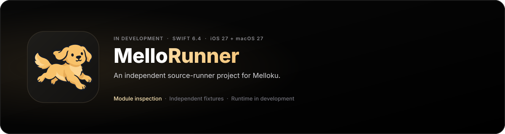

<p align="center">
  <picture>
    <source media="(prefers-color-scheme: dark)" srcset="assets/banner-dark.svg">
    <source media="(prefers-color-scheme: light)" srcset="assets/banner-light.svg">
    
  </picture>
</p>

# MelloRunner

An independent source-runner project for Melloku on iOS 27 and macOS 27, using Swift 6.4.

The package contains a Swift library, Swift Testing tests, and independently generated fixtures. It checks the WebAssembly magic, binary version, and configured input-size limit. It does not execute modules, validate their sections, or run Aidoku-compatible sources yet.

## Build and use

```sh
swift build
swift test
```

## Layout

- `Sources/MelloRunner`: runtime library for WebAssembly execution, host services, Postcard serialization, and session management.
- `Tests/MelloRunnerTests`: contract, unit, and integration tests with self-contained fixtures.
- `docs`: product scope, architecture, and architecture decision records.

[Scope](docs/PRODUCT.md) · [Architecture](docs/ARCHITECTURE.md) · [Engine Decision](docs/decisions/0001-engine-selection.md)
